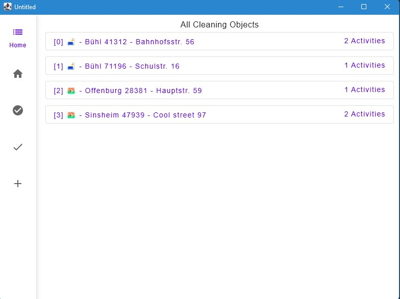
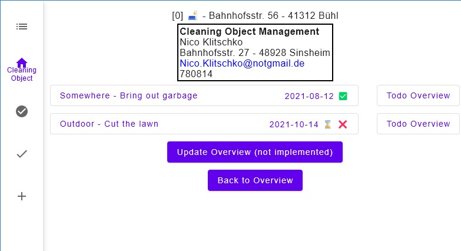
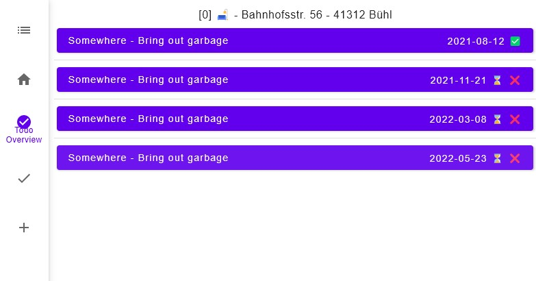
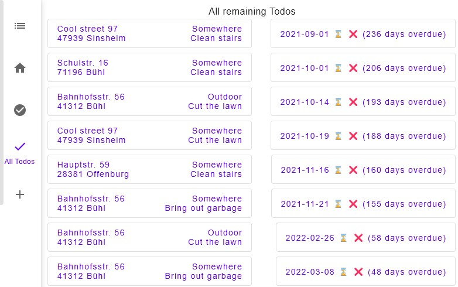
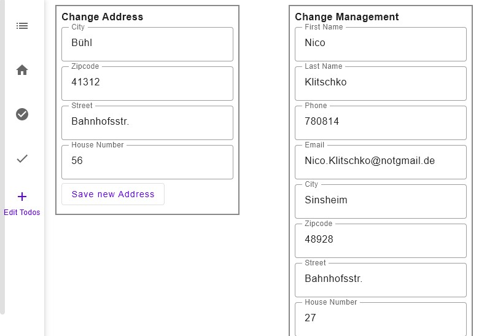

# JanitorManager
Project für "Advanced Software Engineering"

Folgende Schritte müssen ausgeführt werden, um das Projekt aufzusetzen.
<ol>
  <li>IntelliJ IDEA starten</li>
  <li>Projekt von GitHub clonen und in IntelliJ öffnen (https://github.com/Huh-David/JanitorManager)</li>
  <li>Unter View > Tool Windows > Gradle aktivieren</li>
  <li>Im Gradle Fenster unter Tasks > compose desktop > run ausführen, um Programm zu starten.</li>
  <li>Im Gradle Fenster unter Tasks > verification > test ausführen, um Tests zu starten.</li>
</ol>

## Programmbeschreibung

Bei Programmstart werden alle bereits angelegten CleaningObjects (aktuell zufällig generierte Demo-Daten) in Form einer List angezeigt.

Klickt man auf ein Element der Liste, werden weitere Informationen und anstehende oder bereits überfällige Todos zum jeweiligen CleaningObject angezeigt.

Klickt man nun auf "Todo Overview", erscheinen alle Todos zu einer bestimmten Aktivität.

Unter dem vierten Reiter in der Navigationsleiste links werden alle Todos von allen CleaningObjects in chronologischer Reihenfolge angezeigt.

Und innerhalb des letzten Reiters können bereits CleaningObjects editiert werden.

Weitere Informationen sind in der [Projektdokumentation](https://github.com/Huh-David/JanitorManager/blob/master/Projektdokumentation.pdf)  zu finden.

Die gesetzten Ziele für den Programmentwurf sind in der aktuellen [Themeneinreichung](https://github.com/Huh-David/JanitorManager/blob/master/Themeneinreichung_Programmentwurf.pdf) zu finden.
